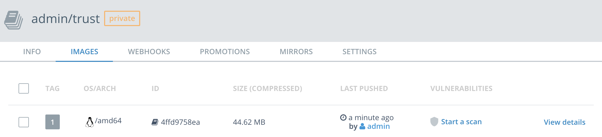
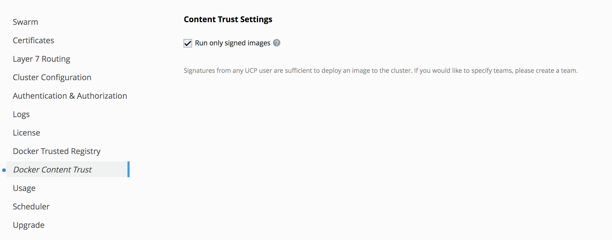
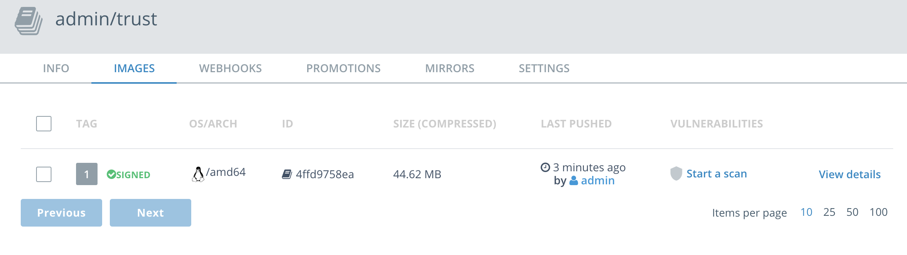

# Docker Content Trust Sample

## Brief
UCP client bundle
Docker Content Trust 

###  push image to DTR and deploy k8s pod (DCT disabled)
```
jzmac:tmp docker$ docker pull nginx:latest
latest: Pulling from library/nginx
be8881be8156: Pull complete
32d9726baeef: Pull complete
87e5e6f71297: Pull complete
Digest: sha256:d85914d547a6c92faa39ce7058bd7529baacab7e0cd4255442b04577c4d1f424
Status: Downloaded newer image for nginx:latest
jzmac:tmp docker$ docker tag nginx:latest 172.28.128.10:12391/admin/trust:1
jzmac:tmp docker$ docker push  172.28.128.10:12391/admin/trust:1
The push refers to repository [172.28.128.10:12391/admin/trust]
08d25fa0442e: Pushed
a8c4aeeaa045: Pushed
cdb3f9544e4c: Pushed
1: digest: sha256:4ffd9758ea9ea360fd87d0cee7a2d1cf9dba630bb57ca36b3108dcd3708dc189 size: 948
```




```
jzmac:mis docker$ cat trustpod.yaml
apiVersion: v1
kind: Pod
metadata:
  name: nginx
  labels:
    app: nginx
spec:
  containers:
  - name: nginx
    image: 172.28.128.10:12391/admin/trust:1
    ports:
    - containerPort: 80
```


```
jzmac:mis docker$ kubectl create -f trustpod.yaml
pod "nginx" created
jzmac:mis docker$ kubectl get pod
NAME      READY     STATUS    RESTARTS   AGE
nginx     1/1       Running   0          2s
```

```
jzmac:mis docker$ kubectl delete pod nginx
pod "nginx" deleted
```

### enable Content Trust in UCP



### deploy failed (as expected)
```
jzmac:mis docker$ kubectl create -f trustpod.yaml
Error from server (Forbidden): error when creating "trustpod.yaml": pods "nginx" is forbidden: one or more container images do not meet the required signing policy: [172.28.128.10:12391/admin/trust:1: image or trust data does not exist for 172.28.128.10:12391/admin/trust:1]
```


### DCT: add signer role

```
docker trust signer add admin 172.28.128.10:12391/admin/trust --key ~/tmp/ucp-bundle-admin/cert.pem
Adding signer "admin" to 172.28.128.10:12391/admin/trust...
Enter passphrase for repository key with ID c097074:
Successfully added signer: admin to 172.28.128.10:12391/admin/trust
```

### DCT: add signer key
```
jzmac:trust docker$ docker trust key load /Users/docker/tmp/ucp-bundle-admin/key.pem
Loading key from "/Users/docker/tmp/ucp-bundle-admin/key.pem"...
Enter passphrase for new signer key with ID ca73c5d:
Repeat passphrase for new signer key with ID ca73c5d:
Successfully imported key from /Users/docker/tmp/ucp-bundle-admin/key.pem
```

### sign image
```
jzmac:trust docker$ docker trust sign 172.28.128.10:12391/admin/trust:1
Signing and pushing trust data for local image 172.28.128.10:12391/admin/trust:1, may overwrite remote trust data
The push refers to a repository [172.28.128.10:12391/admin/trust]
08d25fa0442e: Layer already exists
a8c4aeeaa045: Layer already exists
cdb3f9544e4c: Layer already exists
1: digest: sha256:4ffd9758ea9ea360fd87d0cee7a2d1cf9dba630bb57ca36b3108dcd3708dc189 size: 948
Signing and pushing trust metadata
Enter passphrase for signer key with ID ca73c5d:
Successfully signed 172.28.128.10:12391/admin/trust:1
```

### image marked as signed


### re-depoloy with success
```
jzmac:mis docker$ kubectl create -f trustpod.yaml
pod "nginx" created
jzmac:mis docker$ kubectl get pod
NAME      READY     STATUS    RESTARTS   AGE
nginx     1/1       Running   0          30s
```